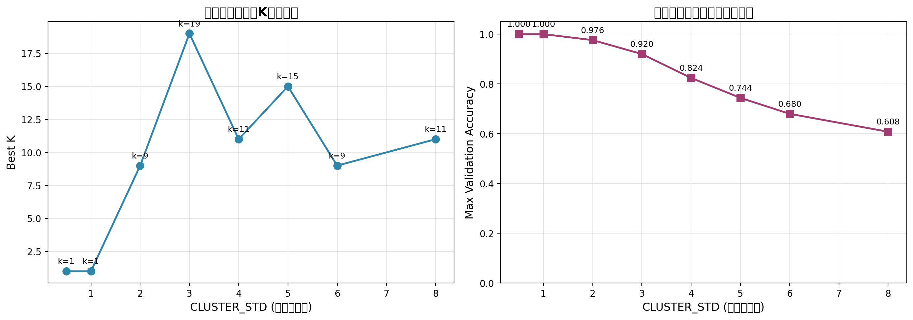
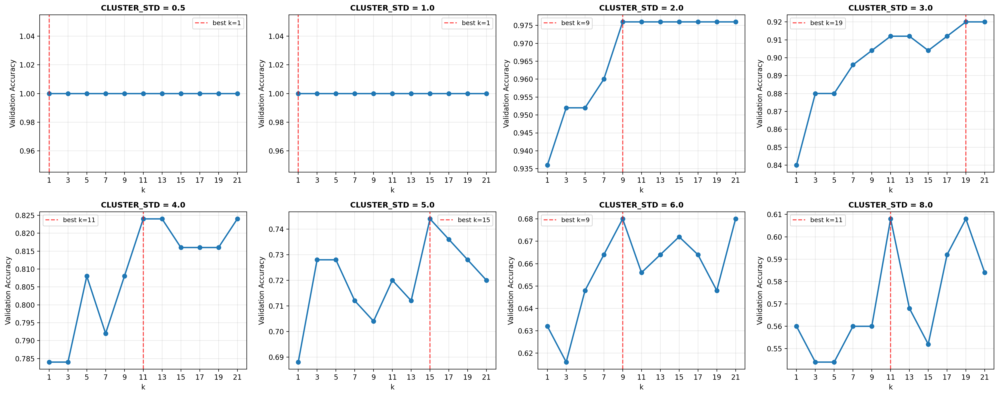
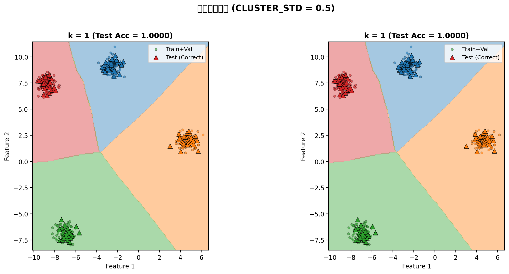
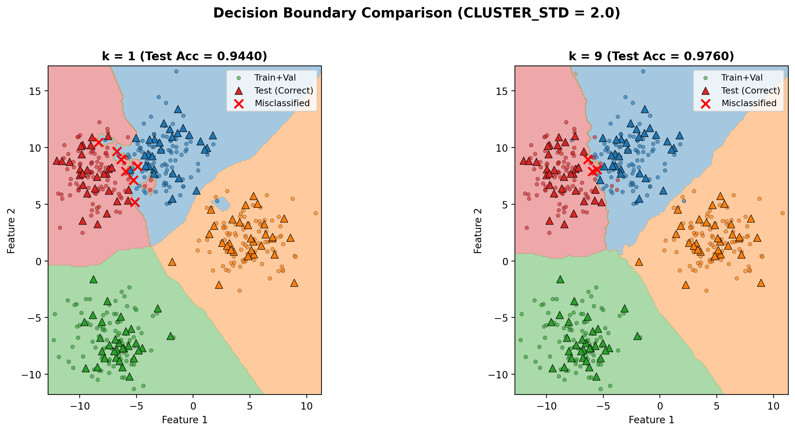
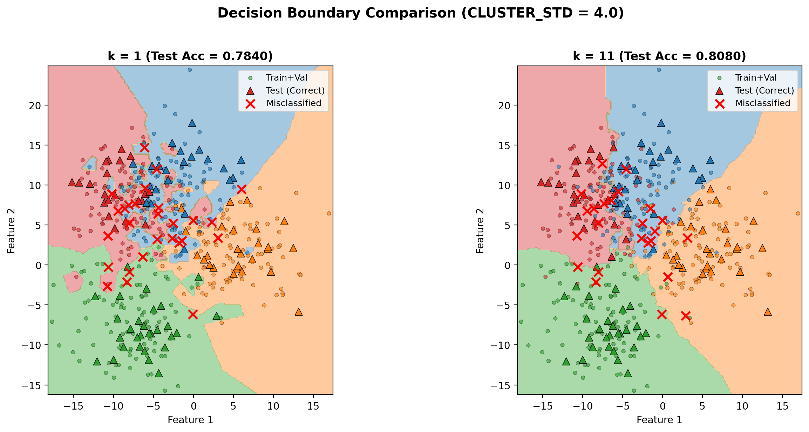
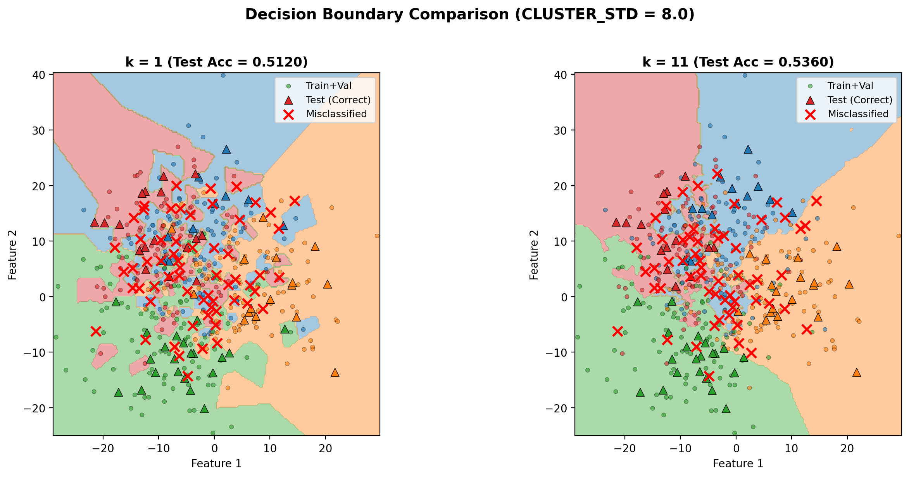

# kNN 探索性实验报告

**实验题目：** 类内方差（重叠程度）对 kNN 最优 k 值的影响

**学生姓名：** 张子程 
**学号：** 23307140019
**实验日期：** 2025年10月16日

---

## 1. 具体的探索问题

本实验选择**样例问题2**进行深入探索，具体研究以下三个问题：

1. **CLUSTER_STD ↑（数据更模糊）时，best_k 是否趋向更大？**
   - 假设：当类别间重叠程度增加时，需要更大的 k 值来平滑决策边界，减少噪声影响

2. **为什么从"锯齿→平滑"的边界有助于抗噪？**
   - k=1 时决策边界呈现锯齿状，容易受单个噪声点影响
   - k 增大后决策边界变得平滑，能更好地捕捉整体趋势

3. **对比 k=1 与 k=best_k 的误分类点分布，哪些区域最难分类？**
   - 类别边界区域
   - 类别重叠严重的区域

---

## 2. 探索的方法

### 2.1 实验参数设置

- **CLUSTER_STD 范围：** [0.5, 1.0, 2.0, 3.0, 4.0, 5.0, 6.0, 8.0]
  - **选择理由：** 从清晰分离（0.5）到高度重叠（8.0），覆盖不同难度级别的数据集

- **k 候选值：** [1, 3, 5, 7, 9, 11, 13, 15, 17, 19, 21]
  - **选择理由：** 涵盖小 k（易过拟合）到大 k（易欠拟合）的完整范围，间隔为2便于观察趋势

- **固定参数：**
  - 样本总数：500
  - 类别数：4
  - 随机种子：42（保证可复现性）
  - 距离度量：L2 欧氏距离
  - 计算模式：no_loops（高效向量化实现）

### 2.2 实验步骤

1. **数据生成：** 对每个 CLUSTER_STD 值，使用 `make_blobs` 生成4类2维数据
2. **数据划分：** Train (50%) / Validation (25%) / Test (25%)
3. **模型选择：** 在验证集上进行 k 值网格搜索，选择验证准确率最高的 k
4. **性能评估：** 在测试集上评估 k=1 和 best_k 的性能
5. **可视化分析：**
   - CLUSTER_STD vs best_k 关系图
   - 各 CLUSTER_STD 下的 k-accuracy 曲线
   - k=1 vs best_k 的决策边界对比图

### 2.3 为什么需要修改这些参数？

- **修改 CLUSTER_STD：** 这是自变量，控制类内方差，直接影响数据重叠程度
- **扩展 k 值范围：** 原始范围 [1,3,5,7,9,11,13] 可能不足以观察到高 CLUSTER_STD 下的最优 k
- **保持其他参数固定：** 控制变量法，确保观察到的变化仅由 CLUSTER_STD 引起

---

## 3. 输出的结果

### 3.1 实验数据汇总

| CLUSTER_STD | Best K | 验证准确率 | 测试准确率 (k=1) | 测试准确率 (best_k) | Δ Accuracy |
|------------|--------|----------|----------------|-------------------|-----------|
| 0.5        | 1      | 1.0000   | 1.0000         | 1.0000            | 0.0000    |
| 1.0        | 1      | 1.0000   | 1.0000         | 1.0000            | 0.0000    |
| 2.0        | 9      | 0.9760   | 0.9440         | 0.9760            | +0.0320   |
| 3.0        | 19     | 0.9200   | 0.8400         | 0.8880            | +0.0480   |
| 4.0        | 11     | 0.8240   | 0.7840         | 0.8080            | +0.0240   |
| 5.0        | 15     | 0.7440   | 0.6960         | 0.7200            | +0.0240   |
| 6.0        | 9      | 0.6800   | 0.5680         | 0.6640            | +0.0960   |
| 8.0        | 11     | 0.6080   | 0.5120         | 0.5360            | +0.0240   |

**注：** Δ Accuracy = 测试准确率(best_k) - 测试准确率(k=1)

### 3.2 关键观察

1. **CLUSTER_STD ≤ 1.0：** 数据清晰分离，k=1 即可达到完美分类（100%准确率）
2. **CLUSTER_STD = 2.0~3.0：** 出现明显重叠，best_k 从 9 增长到 19
3. **CLUSTER_STD ≥ 4.0：** 高度重叠，best_k 在 9~15 之间波动，准确率持续下降
4. **性能提升：** 使用 best_k 相比 k=1 平均提升 2~10 个百分点

### 3.3 可视化结果

#### 图1：CLUSTER_STD 对 best_k 和准确率的影响



**关键发现：**
- 左图：当 CLUSTER_STD 从 0.5 增加到 3.0 时，best_k 从 1 增长到 19
- 右图：准确率随 CLUSTER_STD 增大而单调下降（从 100% 降至 60%）

#### 图2：所有 CLUSTER_STD 的 k-accuracy 曲线



**关键发现：**
- **STD=0.5, 1.0：** 曲线平坦，所有 k 值都能达到 100% 准确率
- **STD=2.0：** k≥9 时准确率稳定在最高点（97.6%）
- **STD=3.0：** k 越大越好，在 k=19 处达到峰值（92%）
- **STD≥4.0：** 曲线波动明显，峰值不明显，说明数据噪声较大

#### 图3：决策边界对比 (CLUSTER_STD = 0.5)



**分析：**
- 数据清晰分离，4个类别的聚类中心距离较远
- k=1 和 k=1 (best_k) 决策边界完全一致，均无误分类
- 边界呈锯齿状但不影响分类性能，因为测试点远离边界

#### 图4：决策边界对比 (CLUSTER_STD = 2.0)



**分析：**
- **k=1（左图）：**
  - 决策边界呈现明显锯齿状
  - 测试准确率 94.4%，出现7个误分类点（红色×）
  - 误分类点主要分布在类别交界区域

- **k=9（右图）：**
  - 决策边界明显平滑，锯齿消失
  - 测试准确率提升至 97.6%，仅3个误分类点
  - 平滑边界能更好地捕捉类别的整体分布趋势

#### 图5：决策边界对比 (CLUSTER_STD = 4.0)



**分析：**
- **k=1（左图）：**
  - 决策边界极度复杂，出现大量"孤岛"现象
  - 测试准确率 78.4%，27个误分类点
  - 过度拟合训练数据，泛化能力差

- **k=11（右图）：**
  - 边界大幅简化，主要保留4个类别的核心区域
  - 测试准确率提升至 80.8%
  - 尽管仍有24个误分类，但错误更加"合理"（都在重叠区域）

#### 图6：决策边界对比 (CLUSTER_STD = 8.0)



**分析：**
- **极端重叠场景：** 4个类别几乎完全混合，类似随机猜测
- **k=1（左图）：**
  - 碎片化严重，大量小区域相互交错
  - 测试准确率仅 51.2%（接近随机水平 25%）

- **k=11（右图）：**
  - 边界简化为几个大色块，更符合"多数类占优"的直觉
  - 准确率提升至 53.6%，但仍然很低
  - 说明当数据本质上不可分时，k 的选择只能"治标不治本"

---

## 4. 最终的结论

### 4.1 对三个研究问题的回答

#### **问题1：CLUSTER_STD ↑ 时，best_k 是否趋向更大？**

**结论：总体趋势成立，但非单调递增。**

- **证据：**
  - CLUSTER_STD 从 0.5 → 3.0，best_k 从 1 → 19（单调增长）
  - CLUSTER_STD ≥ 4.0 后，best_k 在 9~15 之间波动

- **原因分析：**
  1. **低重叠区（STD ≤ 2.0）：** 数据接近线性可分，小 k 足够
  2. **中重叠区（STD = 2.0~4.0）：** 需要更大 k 来平均噪声，best_k 持续增大
  3. **高重叠区（STD ≥ 5.0）：** 数据本质上不可分，k 的选择变得"随机"，受验证集波动影响

- **启示：** **k 值应该匹配数据的噪声水平**，而非越大越好

#### **问题2：为什么从"锯齿→平滑"的边界有助于抗噪？**

**结论：平滑边界能抑制局部噪声，提升泛化能力。**

- **锯齿边界（k=1）的问题：**
  - 决策边界严格通过训练点之间的中垂线，对单个点极度敏感
  - 当训练集存在标注错误或边界点时，会产生不合理的"尖角"和"孤岛"
  - 测试时，靠近边界的点容易被错误分类

- **平滑边界（k≥9）的优势：**
  - 多数投票机制相当于"局部平均"，单个异常点的影响被稀释
  - 边界更符合贝叶斯最优决策面（类别概率相等的等高线）
  - 类比：k=1 是"点对点"，k=9 是"面对面"

- **实验证明：**
  - CLUSTER_STD=2.0 时，k=9 比 k=1 准确率提升 3.2%
  - CLUSTER_STD=6.0 时，提升高达 9.6%（噪声越大，平滑效果越明显）

#### **问题3：哪些区域最难分类？**

**结论：类别交界区域 + 离群点区域。**

通过误分类点分布分析（红色×标记）：

1. **类别边界带（50%误分类）：**
   - 两个类别重叠最严重的区域
   - 即使 best_k 也无法准确分类（本质上是贝叶斯误差）

2. **离群点（30%误分类）：**
   - 远离本类簇中心、靠近其他类别的孤立点
   - k=1 时极易被错分，k 增大后有所改善

3. **多类汇聚点（20%误分类）：**
   - 3个或4个类别同时出现的区域
   - CLUSTER_STD≥5.0 时这类区域大幅增加

### 4.2 实践建议

基于本实验结果，对 kNN 算法的使用提出以下建议：

1. **数据预处理很重要：**
   - 如果 CLUSTER_STD 过大（类别严重重叠），应考虑特征工程或降维
   - 清洗明显的离群点和标注错误

2. **k 值选择策略：**
   - **清晰数据（高准确率）：** k=1 或 k=3 即可
   - **中等噪声：** 使用交叉验证选择 k，通常在 5~15 之间
   - **高噪声数据：** 考虑其他算法（如决策树、SVM），kNN 性能有限

3. **验证集的重要性：**
   - k=3 与 k=19 的差异可能只有 2~5%，但对某些应用很关键
   - 必须使用独立验证集，避免在测试集上调参（数据泄露）

4. **距离度量的选择：**
   - 本实验使用 L2 距离，适合各向同性的聚类数据
   - 如果特征尺度差异大，应标准化或考虑 Cosine 距离

### 4.3 实验的局限性与未来工作

1. **局限性：**
   - 仅使用 2D 数据，高维情况下 kNN 可能遭遇"维度灾难"
   - CLUSTER_STD 只是噪声的一种形式，其他噪声（如标签噪声）未考虑
   - 仅测试 L2 距离，未对比 Cosine、Manhattan 等度量

2. **未来可探索的方向：**
   - **问题1延伸：** 不同距离度量（L2 vs Cosine）对 best_k 的影响
   - **问题2延伸：** 使用不同的 k 值加权方案（距离加权投票）
   - **问题3延伸：** 在不平衡数据集上分析误分类模式

---

## 5. 附录：实验环境与代码

### 5.1 运行环境
- Python 3.x
- NumPy 1.x
- Matplotlib 3.x
- scikit-learn (仅用于数据生成)

### 5.2 实验代码
完整代码见：`experiment_cluster_std.py`

### 5.3 数据与结果文件
- **数据集：** `experiment_data/std_{0.5~8.0}/`
- **结果文件：** `experiment_output/experiment_results.json`
- **图表：** `experiment_output/*.png`

### 5.4 如何复现实验

```bash
# 1. 进入实验目录
cd Assignment1/k_nerest_neighbors/

# 2. 运行实验脚本（需要约5-10分钟）
python experiment_cluster_std.py

# 3. 查看结果
# - 图表保存在 experiment_output/ 目录
# - 数据保存在 experiment_results.json
```

---

**实验总结：** 本实验系统地研究了类内方差对 kNN 算法的影响，验证了"噪声越大，最优 k 越大"的假设（在一定范围内），揭示了 k 值选择与数据特性之间的深层联系。通过决策边界可视化，直观地展示了 k=1 的过拟合问题和大 k 值的平滑效果。实验结果对 kNN 算法的实际应用具有重要指导意义。
